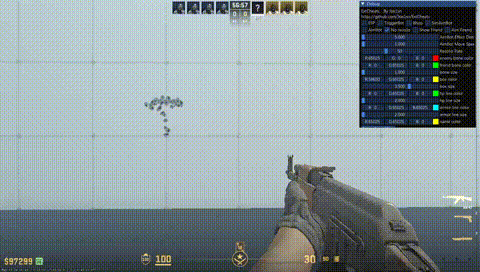

cs2 external cheats | cs2外置外挂

Will be release in Next Mouth (2024-6)

将于下月放出（2024-6）

# ExtCheats

cs2 external cheats | cs2外置外挂

本项目含有微量BUG，今后或许不会更新，并且本说明文档不包括代码中写有的所有功能说明

ExtCheats是一个业余爱好项目，其本质如此也应该被如此看待。同时对电子游戏作弊行为持强烈的反对态度。如果您使用ExtCheats进行作弊，您不仅会破坏游戏的公平性和乐趣，还会损害您自己的信誉和尊严。

 

用前必读
 

- 个人建议：类似于CS这种高度竞技化的游戏，没有必要过于认真对待，因为总有人比您训练的更长时间，一天中的时间是有限的，我希望您能将时间花在更有利于身心健康的事情上。简单的来说就是打不过就直接放弃，去玩其他的游戏或者做其他的事。
- 电子游戏中的作弊可能反映了您内心的不安和不满。您可能觉得自己在游戏中不够优秀，或者受到了其他玩家的嘲笑和排斥。您可能希望通过作弊来提高您的游戏水平和社交地位，或者给自己带来一些快乐和成就感。然而，这些都是表面的和短暂的，不能真正解决您的问题。
- 作弊会让您失去游戏的挑战和乐趣，也会让您失去其他玩家的尊重和信任。作弊会让您陷入一种虚假的自我认知，让您忽视了您真正的优点和潜力。作弊会让您错过了通过努力和学习来提升自己的机会和过程。
- 如果您想摆脱作弊的诱惑和后果，您需要正视您的心理状态和动机，并寻求专业的帮助和支持。与一位心理咨询师或辅导员沟通，可以帮助您找到更健康和有效的应对方式，也可以帮助您建立更积极和自信的自我形象。您也可以参与一些有益的活动和社交，例如加入一些游戏社区或俱乐部，结交一些志同道合的朋友，或者尝试一些新的游戏或兴趣。
- 我希望您能够认识到作弊的危害和无意义，也希望您能够享受游戏的真正乐趣和价值。

# 简介

**CS2的开源作弊，使用C++编写**

该外挂会导致VAC，并且该外挂使用外置方式进行作弊，因此不推荐用于**HvH**比赛，为了您的账号安全，请在开启游戏时加上`-insecure`选项

# 更新

**2024-5-23**：优化菜单，新增人物发光、避免闪光弹功能

# 使用

双击启动后，会创建一个新的置顶窗口，使用`Alt+Tab`切换到该窗口来调整参数

参数说明

​	

# 功能

作弊菜单使用`F1`隐藏和开启

- 透视

  

- 5-23：人物发光

  

- 5-23：免疫闪光弹

  

- 自动扳机(triggerbot，适用于预瞄)

  长按`E`在激活功能的时候自动开火，此限制在于避免瞄准队友

  

- 自瞄 (高风险功能)

  

- 连跳

  

- 无后座

  

# 更多

部分技术细节会放在下面的公众号发出

或许我们的微信公众号< **不止Sec** >会有你更多感兴趣的内容

